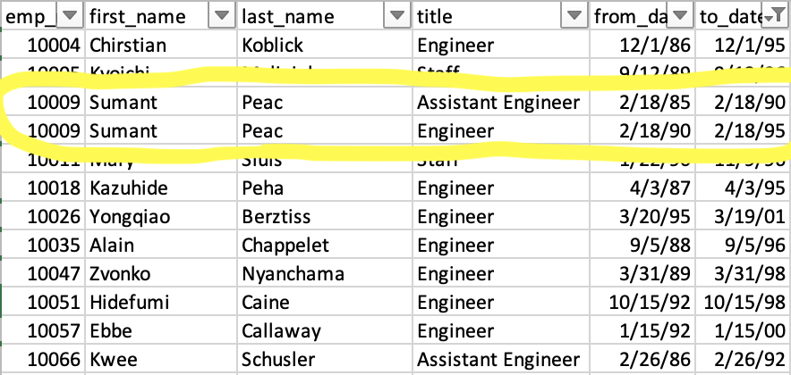

# Pewlett Hackard Analysis

## Overview
### Purpose
After helping Pewlett Hackard consolidate their company HR information into a database to find out how many employees could be retiring in the near future, we were asked to look more specifically at the titles of retiring employees and employees eligible for a mentorship program the executives were considering.

## Results
### Retiring Titles
  1. Our initial query returned a table of all employees eligible for retirement, regardless of whether or not they were still with the company and including all of their past titles. This table was a good starting point, but there was too much noise and unnecessary data points that didn't help our analysis.

  2. Our secondary querey was mores specific and presented us with only employees who were still currently with the company and their most recent title (the title we would have to backfill if they were to depart). This allowed us to see the specific employees we needed to follow as potential retirees. However, it wasn't as helpful with understanding the specific number of roles we would have to consider filling. 
  3. Our final querey presented us with the data necessary to comprehend the amount of roles that could be left unfilled if all retirement eligbile employees just up and left. Looking at our "retiring_titles" csv, we can see that: 72,458 of Pewlett Hackard employees were up for retirement. 70% of those employees fill the "Senior Engineer" and "Senior Staff" roles. This would be where the bulk of attention would go to ensure those slots get filled, presumably by younger employees who have a level of seniority in the company. 

### Mentorship Eligibility
  4. After discovering our potential departing employees and the number of roles we would need to fill, we next looked into the employees that could benefit from a mentorship program to fill the senior level roles being vacated. The querey returned a list of employees with their current role, allowing us to see who could be up for a promotion through a mentorship.

## Summary
### Questions
 - Q. How many roles will need to be filled as the "silver tsunami" begins to make an impact?
 - A. Looking at our "retiring_titles" csv file we create, 7 unique roles will need to be filled, with the largest exodus from the "Senior Engineer" and "Senior Staff" roles. In total, as many as 72,458 roles could need to be filled in the near future. 70% of those roles are with the title of "Senior Engineer" or "Senior Staff".
 - Q. Are there enough qualified, retirement-ready employees in the departments to mentor the next generation of Pewlett Hackard employees?
 - A. 
### Other Queries
